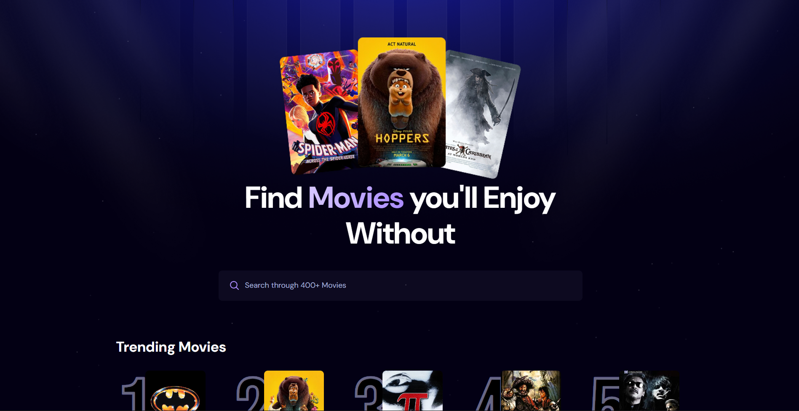
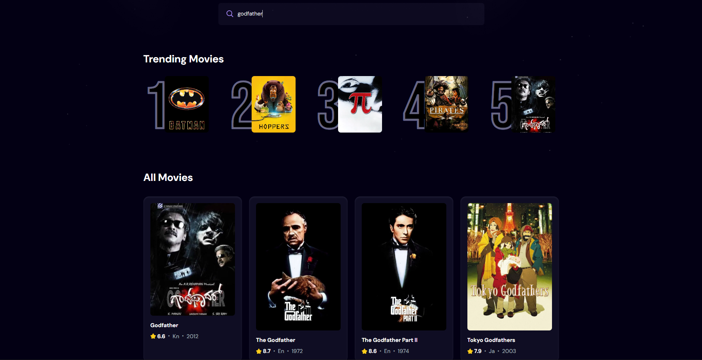
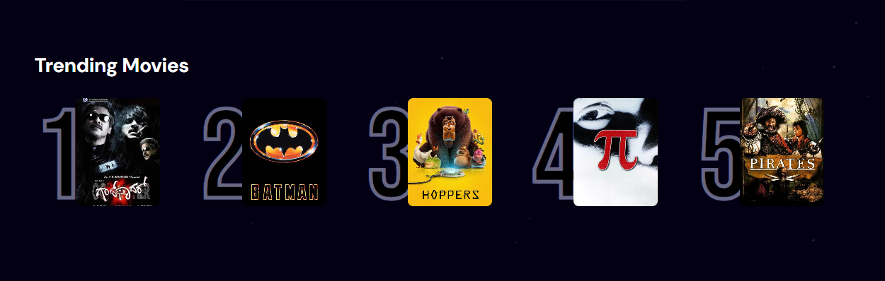

# 🎬 Movie Discovery App

A modern movie discovery web app that allows users to search for movies in real-time, explore popular titles, and view trending movies based on user search behavior.

---

## 🚀 Features

* 🔍 **Real-time Movie Search**

  * Debounced search input for optimized API calls
  * Instant results from TMDB API

* 📈 **Trending Movies System**

  * Tracks user searches using Appwrite
  * Displays top trending movies based on search frequency

* 🎞️ **Popular Movies Feed**

  * Discover movies sorted by popularity
  * Pagination with "Load More" functionality

* ⚡ **Performance Optimizations**

  * Debounced API requests
  * Efficient state management
  * Lazy loading-ready structure

* 🎨 **Modern UI**

  * Built with Tailwind CSS
  * Responsive design

---

## 🛠️ Tech Stack

### Frontend

* React (Vite)
* Tailwind CSS

### Backend / Services

* Appwrite (Database for tracking trends)
* TMDB API (Movie data)

---

## 📂 Project Structure

```
src/
│
├── Components/
│   ├── Search.jsx
│   ├── MovieCard.jsx
│   └── Spinner.jsx
│
├── App.jsx
├── appwrite.js
└── index.css
```

---

## ⚙️ Environment Variables

Create a `.env` file in the root and add:

```
VITE_TMDB_API_KEY=your_tmdb_bearer_token
VITE_APPWRITE_PROJECT_ID=your_project_id
VITE_APPWRITE_DATABASE_ID=your_database_id
VITE_APPWRITE_TABLE_ID=your_table_id
```

---

## 🧠 How Trending Works

1. When a user searches for a movie:

   * The search term is stored in Appwrite
   * A count is incremented for that term

2. Trending movies are determined by:

   * Sorting search terms by highest count
   * Displaying associated movie data

---

## 📸 Screenshots

### 🏠 Home Page


### 🔍 Search Results


### 📈 Trending Movies


---

## 🧩 Installation & Setup

1. Clone the repository:

```
git clone https://github.com/your-username/movie-app.git
```

2. Navigate to project:

```
cd movie-app
```

3. Install dependencies:

```
npm install
```

4. Start development server:

```
npm run dev
```

---

## 🌐 API Reference

* TMDB API: https://developer.themoviedb.org/
* Appwrite: https://appwrite.io/

---

## 📌 Notes

* Ensure your TMDB API key has proper access
* Appwrite database must have correct schema:

  * `searchTerm` (string)
  * `count` (number)
  * `movie_id` (string/number)
  * `poster_url` (string)

---

## 🤝 Contributing

Contributions are welcome! Feel free to fork the repo and submit a PR.

---

## 📄 License

This project is open-source and available under the MIT License.

---

## 💡 Author : Sarthak Kothiyal

Built with ❤️ using React, Appwrite, and TMDB API.
